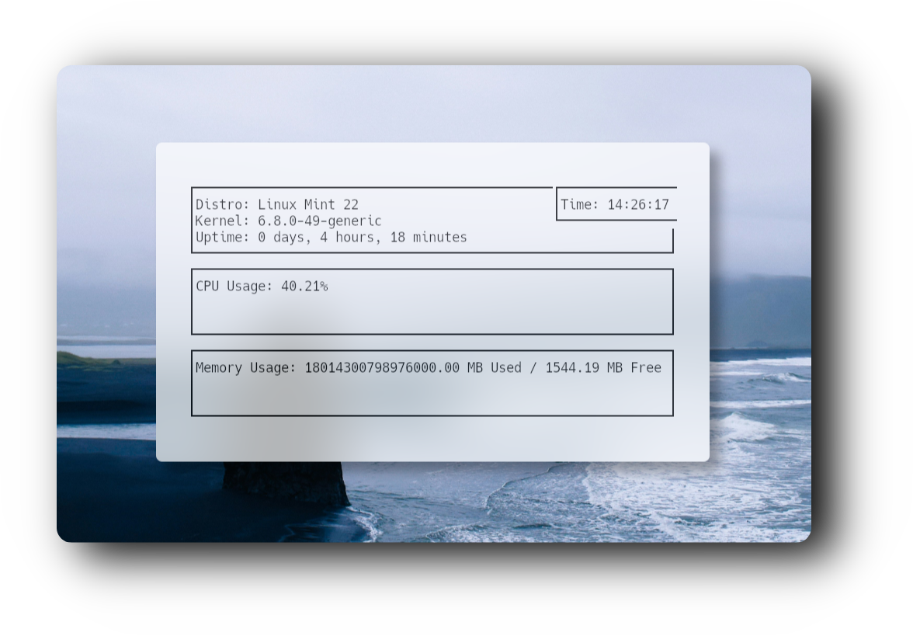

<div align="center">

### :octocat: ‎ <sup><sub><samp>HI THERE! THANKS FOR DROPPING BY!</samp></sub></sup>


<div align="center">
  <h1>🖥️ <strong>𝗦𝗬𝗦𝗧𝗢𝗣 ● 𝗔 𝗠𝗶𝗻𝗶𝗺𝗮𝗹 𝗦𝘆𝘀𝘁𝗲𝗺 𝗜𝗻𝗳𝗼𝗿𝗺𝗮𝘁𝗶𝗼𝗻 𝗣𝗿𝗼𝗴𝗿𝗮𝗺 𝘄𝗿𝗶𝘁𝗲𝗻 𝗶𝗻 𝗖</strong> 🖥️</h1>
</div>


 <h1>
      
</div>
</div> 


## ⚙️ Features

- **💻 Per-Core CPU Usage** Show CPU utilization for each core.
  
- **💾 Disk I/O Stats** Include read/write speeds for disks. 

- **🌐 Network Usage** Show bandwidth utilization for network interfaces.
  
- **🔎 Detailed Memory Breakdown** Include PID, command, CPU%, MEM%, and more. 


‎ ‎ ‎ ‎ ‎ ‎ ‎ ‎ ‎ ‎ ‎ ‎ 
‎ 


<div align="center">


‎ ‎ ‎ ‎ ‎ ‎ ‎ ‎ ‎ ‎ ‎ ‎ ‎ ‎ ‎ ‎ 

‎ ‎ ‎ ‎ ‎ ‎ ‎ ‎ ‎ ‎ ‎ ‎ ‎ ‎ ‎ ‎ ‎ ‎ ‎ ‎ ‎ ‎ ‎ ‎ ‎ ‎ ‎ ‎ ‎ ‎ ‎ ‎ ‎ ‎ ‎ ‎ ‎ ‎ 
‎ ‎ ‎ ‎ ‎ ‎ ‎ ‎ ‎ ‎ ‎ ‎ ‎ ‎ ‎ ‎ ‎ ‎ ‎ 

📦 𝘽𝙪𝙞𝙡𝙙 𝙖𝙣𝙙 𝙍𝙪𝙣

To compile and run systop, follow these steps 👇:


```bash
git clone https://github.com/user7210unix/systop.git
cd systop
gcc -o systop systop.c -lncurses
./systop
